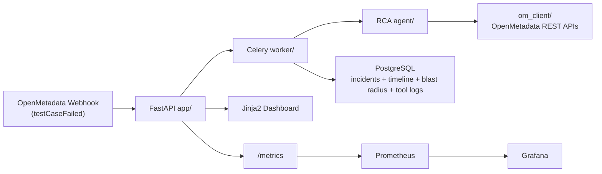

# DataLineage Doctor

> "Your revenue dashboard shows $0. It is 9:00 AM. The CEO is already asking why."

## What It Does
DataLineage Doctor is an AI incident responder for OpenMetadata. When a `testCaseFailed` webhook arrives, it launches an RCA agent that gathers lineage, data quality history, pipeline status, ownership, and local incident history, then produces a structured report with timeline, blast radius, confidence, and remediation steps.

## Demo


## Quick Start
Prerequisites:
- Docker + Docker Compose
- `make`
- OpenMetadata token configured in `.env` (`OM_JWT_TOKEN`)
- LLM credentials configured in `.env` (`LLM_API_KEY`)

After cloning:
```bash
git clone https://github.com/Mahboob-A/Datalineage-Doctor.git
cd Datalineage-Doctor
```

## Development
Run locally:
```bash
make dev
make migrate
make demo
```
- `make dev`: Starts the full Docker Compose stack for local development (App, Worker, DB, Redis, OpenMetadata, Prometheus, Grafana).
- `make migrate`: Applies Alembic database migrations to the local PostgreSQL database.
- `make demo`: Seeds demo data and triggers a simulated test case failure webhook for testing.

Open:
- App dashboard: `http://localhost:8000` (View incidents and lineage graphs)
- Prometheus: `http://localhost:9090` (Metrics collection)
- Grafana: `http://localhost:3000` (View RCA performance and observability dashboards. Demo Password: `admin` / `admin`)
- OpenMetadata: `http://localhost:8585` (Metadata catalog and platform. Demo Password: `admin@open-metadata.org` / `admin`)

## Production
Production runs on a subdomain architecture behind Nginx.

Production commands:
- `make prod`: Builds and starts the production stack using `docker-compose.prod.yml`.
- `make prod-down`: Stops and removes the production stack.
- `make prod-migrate`: Runs Alembic database migrations in the production environment.
- `make prod-logs`: Tails logs for the app, worker, and nginx containers.

Open:
- App dashboard: `https://dldoctor.app` (Production dashboard)
- Prometheus: `https://prometheus.dldoctor.app` (Production metrics)
- Grafana: `https://grafana.dldoctor.app` (Production observability. Demo Password: `admin` / `admin`)
- OpenMetadata: `https://om.dldoctor.app` (Production catalog. Demo Password: `admin@open-metadata.org` / `admin`)

## Architecture


## How the RCA Agent Works
1. Receives incident context (`table_fqn`, `test_case_fqn`, trigger timestamp).
2. Runs iterative tool-calling loop (lineage, DQ results, pipeline status, owners, blast radius, incident history).
3. Logs each tool call and normalizes failures to structured error payloads.
4. Parses strict JSON response into `RCAReport` and recalculates confidence label from confidence score.
5. Persists final report, timeline, blast radius, notifications, and observability metrics.

## Features
- OpenMetadata webhook ingestion (`POST /webhook/openmetadata`)
- Async RCA orchestration with Celery + Redis
- Typed OpenMetadata client with retry and compatibility guards
- Incident list and detail dashboard with lineage graph
- Slack notification on RCA completion (optional)
- OpenMetadata incident create integration (best-effort, version-aware)
- One-command demo flow (`make demo`)
- Structured test suite for app, agent, tools, and OM client

## Observability
The service exports six core Prometheus metrics and a pre-provisioned Grafana dashboard:
- `rca_requests_total{status}`: RCA task completion status counts (`success`/`failure`)
- `rca_duration_seconds`: End-to-end RCA execution latency histogram
- `rca_tool_calls_total{tool_name}`: Tool invocation counts by tool
- `rca_confidence_score`: Latest RCA confidence score gauge
- `blast_radius_size`: Histogram of impacted downstream entities per incident
- `rca_errors_total{error_type}`: RCA error counters (for example `llm_timeout`, `om_api_error`)

## Tech Stack
| Layer | Tech |
|---|---|
| Language | Python 3.12 |
| API | FastAPI |
| Worker | Celery + Redis |
| DB | PostgreSQL 16 + SQLAlchemy 2.0 async |
| Migrations | Alembic |
| LLM SDK | OpenAI-compatible `openai` SDK |
| OM API client | `httpx` async |
| Metrics | Prometheus + Grafana |
| Templates | Jinja2 + React Flow (CDN) |
| Packaging | `uv` |
| Runtime | Docker Compose |

## OpenMetadata Integration
DataLineage Doctor intelligently leverages the OpenMetadata stack to transform an ordinary metadata catalog into an active, self-healing data governance nervous system. By tapping directly into OpenMetadata's core architecture, we've built a robust, context-aware AI agent that reasons over your entire data estate:

- **Webhook-Driven Event Architecture**: We listen asynchronously for OpenMetadata's `testCaseFailed` webhooks, allowing instant, real-time incident response without polling overhead.
- **Deep Lineage Traversal**: We dynamically query the Lineage API to perform graph-based upstream and downstream traversal. This enables the agent to instantly pinpoint root causes (upstream) and calculate precise blast radiuses (downstream).
- **Quality & Pipeline Context**: By intersecting Data Quality API test results and Pipeline Status APIs, the AI triangulates whether a failure is due to bad data, delayed ETL pipelines, or structural schema changes.
- **Ownership-Aware Routing**: The agent automatically pulls entity ownership data to contextualize the incident and route remediations to the correct data stewards, eliminating manual triage.
- **Native Incident Creation**: When an RCA concludes, we feed the structured findings right back into OpenMetadata using its native Incident API, closing the loop directly where data engineers already work.

## Future Work
- Webhook signature verification (HMAC)
- Auth and role-based access on dashboard endpoints
- Multi-tenant deployment model
- Live streaming updates via WebSocket
- Prompt management UI and historical RCA comparison dashboard
