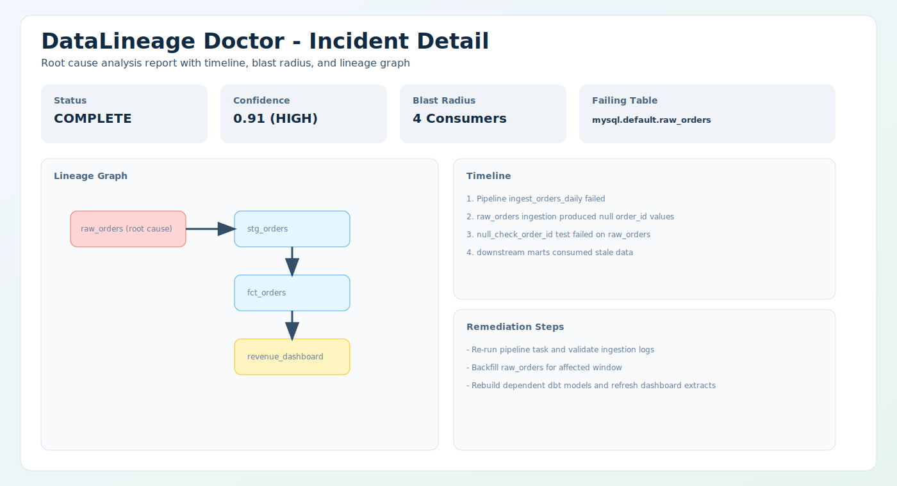
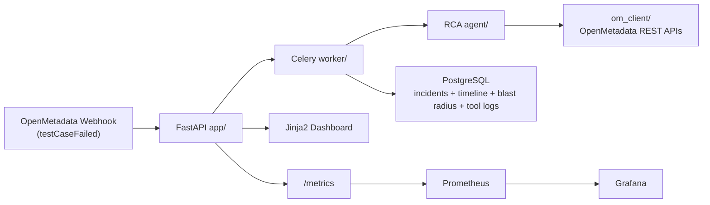

# DataLineage Doctor

> "Your revenue dashboard shows $0. It is 9:00 AM. The CEO is already asking why."

## What It Does
DataLineage Doctor is an AI incident responder for OpenMetadata. When a `testCaseFailed` webhook arrives, it launches an RCA agent that gathers lineage, data quality history, pipeline status, ownership, and local incident history, then produces a structured report with timeline, blast radius, confidence, and remediation steps.

## Demo


## Quick Start
Prerequisites:
- Docker + Docker Compose
- `make`
- OpenMetadata token configured in `.env` (`OM_JWT_TOKEN`)
- LLM credentials configured in `.env` (`LLM_API_KEY`)

Run locally:
```bash
git clone <your-repo-url>
cd openmetadata/code
make dev
make migrate
make demo
```

Open:
- App dashboard: `http://localhost:8000`
- Prometheus: `http://localhost:9090`
- Grafana: `http://localhost:3000` (`admin` / `admin`)
- OpenMetadata: `http://localhost:8585`

## Architecture


## How the RCA Agent Works
1. Receives incident context (`table_fqn`, `test_case_fqn`, trigger timestamp).
2. Runs iterative tool-calling loop (lineage, DQ results, pipeline status, owners, blast radius, incident history).
3. Logs each tool call and normalizes failures to structured error payloads.
4. Parses strict JSON response into `RCAReport` and recalculates confidence label from confidence score.
5. Persists final report, timeline, blast radius, notifications, and observability metrics.

## Features
- OpenMetadata webhook ingestion (`POST /webhook/openmetadata`)
- Async RCA orchestration with Celery + Redis
- Typed OpenMetadata client with retry and compatibility guards
- Incident list and detail dashboard with lineage graph
- Slack notification on RCA completion (optional)
- OpenMetadata incident create integration (best-effort, version-aware)
- One-command demo flow (`make demo`)
- Structured test suite for app, agent, tools, and OM client

## Observability
The service exports six core Prometheus metrics and a pre-provisioned Grafana dashboard:
- `rca_requests_total{status}`: RCA task completion status counts (`success`/`failure`)
- `rca_duration_seconds`: End-to-end RCA execution latency histogram
- `rca_tool_calls_total{tool_name}`: Tool invocation counts by tool
- `rca_confidence_score`: Latest RCA confidence score gauge
- `blast_radius_size`: Histogram of impacted downstream entities per incident
- `rca_errors_total{error_type}`: RCA error counters (for example `llm_timeout`, `om_api_error`)

## Tech Stack
| Layer | Tech |
|---|---|
| Language | Python 3.12 |
| API | FastAPI |
| Worker | Celery + Redis |
| DB | PostgreSQL 16 + SQLAlchemy 2.0 async |
| Migrations | Alembic |
| LLM SDK | OpenAI-compatible `openai` SDK |
| OM API client | `httpx` async |
| Metrics | Prometheus + Grafana |
| Templates | Jinja2 + React Flow (CDN) |
| Packaging | `uv` |
| Runtime | Docker Compose |

## OpenMetadata Integration
APIs used:
- Lineage API (upstream/downstream traversal)
- Data Quality test result APIs
- Pipeline status APIs
- Ownership APIs
- Incident API (when available on the running OM version)

## Hackathon Tracks
- T-01: AI-powered metadata operations with tool-calling RCA agent
- T-02: Observability via Prometheus instrumentation + Grafana dashboard
- T-06: Governance and reliability through ownership-aware incident response

## Future Work
- Webhook signature verification (HMAC)
- Auth and role-based access on dashboard endpoints
- Multi-tenant deployment model
- Live streaming updates via WebSocket
- Prompt management UI and historical RCA comparison dashboard
